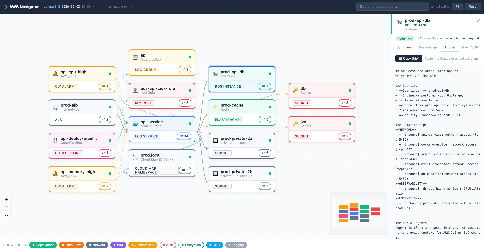

# AWS Ops Navigator

An infinite-canvas architecture explorer for AWS infrastructure snapshots,
built with React 18 and React Flow.

---

## Quick start

```bash
cd navigator
npm install
npm run dev          # opens http://localhost:5173
```

The dev server serves the parent `snapshots/` directory automatically via a Vite middleware.
Two demo snapshots are included in the repo — no export step is needed to get started.
The navigator loads `snapshots/2020-06-03T10-00-00Z-us-east-2` by default.

---

## Production build

```bash
npm run build        # outputs to navigator/dist/
```

Serve from the repo root:

```bash
cd ..
python3 -m http.server 8000
# open http://localhost:8000/navigator/dist/
```

---

## Core concepts

### Infinite canvas

The navigator uses an **infinite canvas** — a zoomable, pannable workspace with no fixed
boundaries. You can place nodes anywhere, zoom from a high-level overview down to a single
service, and drag nodes to arrange them however makes sense for the problem you are solving.
There is no predetermined layout or fixed diagram size; the canvas expands as you add more
resources.



### Empty canvas

The canvas starts empty every session. Resources appear only when you explicitly place them:

- **Search** (top toolbar) → type any resource name, ARN, or ID → click a result to pin it
- **`⇄ N`** button on a node → opens the connection dialog to expand related resources
- **`×`** button on a node (hover to reveal) → removes it from canvas

Nothing is shown automatically. You build exactly the view you need.

---

## Node types

Every AWS resource is a colour-coded card. Categories and examples:

| Category | Colour | Node types |
|---|---|---|
| Compute | Blue | ECS service, EKS cluster, Lambda, EC2 instance |
| Network | Slate | ALB/NLB, API Gateway, CloudFront, VPC, subnet, NAT gateway, VPC endpoint, Cloud Map namespace, CIDR block |
| Data | Green | RDS instance/cluster, Aurora, DocumentDB, Redshift, DynamoDB, ElastiCache, MemoryDB, EFS, S3 bucket, OpenSearch |
| Messaging | Purple | SQS queue, SNS topic, EventBridge rule/bus, Kinesis stream, Firehose, MSK cluster, Step Functions |
| Security | Red | IAM role, Secrets Manager secret, KMS key, ACM certificate, SSM parameter, WAFv2 WebACL, GuardDuty detector |
| CI/CD | Pink | CodePipeline, CodeBuild, ECR repository, Cognito user pool |
| Observability | Amber | CloudWatch alarm, CloudWatch log group |

Each node card shows: resource icon · name · type badge · status indicator ·
`⇄ N` connection button (N = total neighbour count).

---

## Edge types

Nine independent relationship types, toggled via the filter bar at the bottom of the screen:

| Type | Colour | What it represents |
|---|---|---|
| **Deployment** | Green | ALB → ECS service, K8s ALB → EKS cluster, CodePipeline → CodeBuild/ECS, Step Functions → Lambda/ECS, ECS container → ECR image |
| **Data Flow** | Orange | ECS/Lambda reads secret or SSM param, Lambda ← SQS/Kinesis trigger, DynamoDB stream → Lambda, SQS → dead-letter queue, EventBridge rule → Lambda/SQS/SNS |
| **Network** | Slate | SG-to-SG access paths, ECS/Lambda → subnet, subnet → VPC, private CIDR → resource, VPC endpoint → subnet/S3/DynamoDB, NAT gateway → subnet |
| **IAM** | Purple | ECS task/Lambda assumes role, Redshift cluster → attached role, EKS cluster → service role, IAM role trust chains (role → role) |
| **Observability** | Amber | CloudWatch alarm → monitored resource, alarm → SNS action |
| **Auth** | Pink | API Gateway → Cognito JWT authorizer, API Gateway → Lambda REQUEST authorizer, WAFv2 → ALB/CloudFront |
| **Encryption** | Teal | Resource encrypted with KMS key (RDS, DocDB, DynamoDB, S3, EFS, secrets), ALB → ACM certificate, CloudFront → ACM certificate |
| **DNS** | Sky | Cloud Map service discovery registration |
| **Logging** | Gray | ECS container / Lambda → CloudWatch log group |

Hover any filter chip to see a description of what that edge type means.

Enabling a filter is **additive and permanent** within a session — it never auto-disables.
When you expand a connection of type X, the X filter turns on automatically so the edge
becomes visible.

Edges between the same two nodes are separated by a small vertical offset so each type
is individually clickable. Clicking an edge shows a floating popup with type, direction,
and description.

---

## Expanding connections

Click `⇄ N` on any node to open the **connection dialog**:

```
← inbound        Edge Type        outbound →
[+ 2]   ●  Deployment            0  [  ]
[  ]    ●  Data Flow             3  [+ 3]
[+ 1]   ●  Network               2  [+ 2]
[  ]    ●  IAM                   1  [+ 1]
```

- **Left `[+ N]`** — reveal nodes with an edge *pointing into* this node
- **Right `[+ N]`** — reveal nodes this node points *to*
- Clicking an active button collapses (hides the revealed nodes unless they are also
  pinned or held open by another expansion)

Newly revealed nodes are positioned next to their anchor, avoiding overlaps.
If a target node is already on canvas (shared between multiple services), it is moved
next to the current anchor and the viewport pans to show both.

---

## Search

The toolbar search scans **all resources** — including those not yet on canvas.
Results show the resource icon, name, type, and an `off-canvas` badge for hidden resources.

Selecting a result:
1. Pins the resource on canvas permanently
2. Places it near the nearest visible neighbour (or in a free slot)
3. Selects it and opens the detail panel
4. Animates the viewport to it

Search matches on resource name, ARN, DNS name, VPC ID, and other metadata fields.

---

## Detail panel

Click any node to open the right-side detail panel. Four tabs:

| Tab | Content |
|---|---|
| **Summary** | Key metadata: ARN, cluster, task definition, running/desired count, target health, subnets, security groups, task role, DNS aliases, etc. |
| **Relationships** | All edges grouped by type, showing direction and description |
| **AI Brief** | Structured copy-paste context block for AI assistants — includes all AWS identifiers, relationships, and operational state ready for CLI/IaC prompts |
| **Raw JSON** | Full raw snapshot data for the selected resource, with a Copy button |

---

## Snapshot selection

### Default

The navigator reads `snapshots/latest.json` to find the current snapshot folder.
On a fresh clone this loads the demo snapshot `2020-06-03T10-00-00Z-us-east-2`.

Load a specific snapshot via URL parameter:

```
http://localhost:5173/?snapshot=2020-06-03T10-00-00Z-us-east-2
```

### Snapshot picker

Click the current snapshot label in the top-left toolbar to open a dropdown listing
all available snapshots sorted newest-first.

### Snapshot diff

Click the **⇄ compare with…** dropdown next to the current snapshot label to select
a reference snapshot. When set:

- The canvas resets and shows only resources that are **new** (in current, absent from
  reference) or **modified** (present in both but with changed configuration)
- New resources get a `✦ NEW` green badge
- Modified resources get a `◈ CHANGED` amber badge with a list of what changed
- Resources are laid out in a grid: modified on the left, added on the right
- Individual items can be removed with `×`

**Diff detects changes in**: ECS services (deployment, health), Lambda (runtime, role),
RDS (status, instance class), ElastiCache (status), Redshift (node type, count, status),
DynamoDB tables, S3 buckets, SQS queues, SNS topics, API Gateway APIs, Cognito pools.

---

## Running against your own snapshots

1. Run the export script from the repo root:
   ```bash
   ./export-infra-snapshot.sh --region eu-west-1 --profile prod
   ```
2. Point `latest.json` at the new snapshot (the export script does this automatically):
   ```bash
   # latest.json is updated automatically — no manual step needed
   ```
3. Start or refresh the navigator:
   ```bash
   cd navigator && npm run dev
   ```

To re-export just one resource class into an existing snapshot (faster than a full re-run):

```bash
# Example: refresh only ECS data in the demo snapshot
OUT_DIR=snapshots/2020-06-03T10-00-00Z-us-east-2 \
  ./export-scripts/export-ecs.sh --region us-east-2

# Then rebuild the derived topology files
OUT_DIR=snapshots/2020-06-03T10-00-00Z-us-east-2 ./derive-topology.sh
```

---

## Tech stack

| | |
|---|---|
| Framework | React 18 |
| Build | Vite |
| Canvas | `@xyflow/react` v12 (React Flow) |
| Auto-layout | Dagre (left-to-right) |
| Language | TypeScript |
| Styling | Plain CSS |
